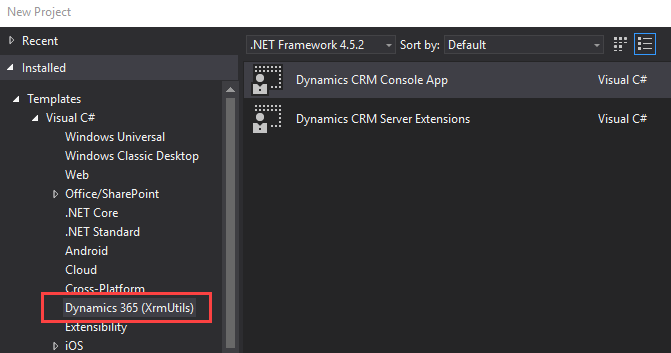
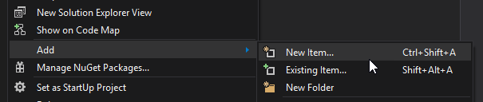
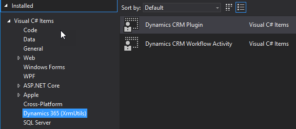
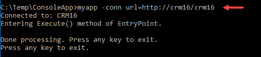
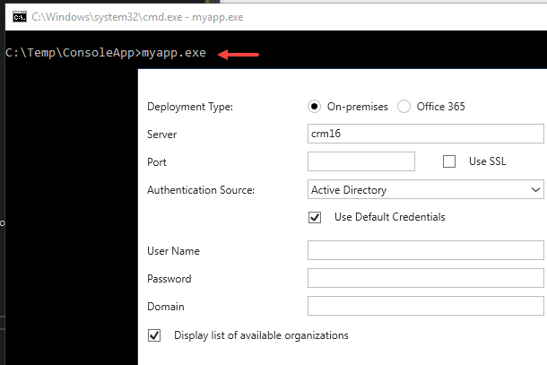

XrmUtils - Dynamics 365 Project Templates
=========================================

Visual Studio 2017 projects template for Dynamics CRM development.

[Download Extension from Visual Studio Marketplace][6]



Plugins and Workflow Activities
-------------------------------

The **Dynamics Crm Server Extensions** template creates a project for plugin and custom workflow activity development.
The created project includes references to the following packages:

- CRM SDK
- ILMerge
- [XrmUtils.CrmSdk.Extensions][1]
- [XrmUtils.CrmSdk.PluginExtensions][2]
- [ILMerge.MSBuild.Task][3]

This is a plugin skeleton initially added to the project:
Form more information on the base classes and extension methods available for plugin and workflow development visit [XrmUtils.CrmSdk.PluginExtensions][2].

```csharp
    [Message("update")]
    [PrimaryEntity("account")]
    [Stage(PipelineStage.PostOperation)]
    [ExecutionMode(ExecutionMode.Synchronous)]
    public class CustomPlugin : PluginBase
    {
        protected override void Execute(LocalPluginContext localContext)
        {
            // set the appropriate class attributes then
            // replace this with your code:

            localContext.Trace("Retrieving target entity.");
            var target = localContext.GetTargetEntity();
        }
    }
```

After the project is created, _Item Templates_ are available when you right click on a project and select _Add/New Item_:



The _Item Templates_ will create class definitions for plugins and custom workflow activities.



#### ILMerge

File `ILMergeConfig.json` is already configured to merge the required assemblies into the project output:

```json
{
  "General": {
    "InputAssemblies": [
      "XrmUtils.Extensions.dll",
      "XrmUtils.Plugins.Extensions.dll"
    ]
  }
}
```

After build your project, the merged assembly you be created under: `(output folder)\ILMerge`.

Visit [ILMerge.MSBuild.Task][3] for more information on the ilmerge task capabilities.

Console Application
-------------------

The **Console App** template creates a console application that is ready to connect to Dynamics 365 on-line or on-premise. Application includes:

- Non interactive connection (command line).
- Interactive connection (login window).
- Built in log.

When a console app is created, all that is left for you is to add your code to the `Execute` method of the `EntryPoint` class.

```csharp
    public class EntryPoint
    {
        private ILog log;
        private IOrganizationService service;

        public EntryPoint(IOrganizationService clientSvc, ILog logger)
        {
            log = logger ?? throw new ArgumentNullException(nameof(logger));
            service = clientSvc ?? throw new ArgumentNullException(nameof(clientSvc));

            log.Trace($"{nameof(EntryPoint)} instantiated.");
        }

        public void Execute()
        {
            // Your code here.
            // use this.log and this.service for logging and CRM access
        }
    }
```

#### Non interactive login

At the command line, `-conn` can be used to pass a connection string.
Visit [Connection string examples][4] for more information on supported connection strings.



#### Interactive login

Calling the executable without passing a connection string will result on a login screen.
The project template implements the [XRM tooling common login control][5]



License
=======

While this project is distributed under the MIT license, it has dependencies on thrid party nuget packages.
Ple make sure you verify and comply with license from each dependency before using this project.

[1]:https://github.com/emerbrito/XrmUtils-Extensions
[2]:https://github.com/emerbrito/XrmUtils-PluginExtensions
[3]:https://github.com/emerbrito/ILMerge-MSBuild-Task
[4]:https://msdn.microsoft.com/en-us/library/mt608573.aspx#Examples
[5]:https://msdn.microsoft.com/en-us/library/dn689071.aspx
[6]:https://marketplace.visualstudio.com/vsgallery/682cfaa8-9192-426d-88ba-66910167aa5e